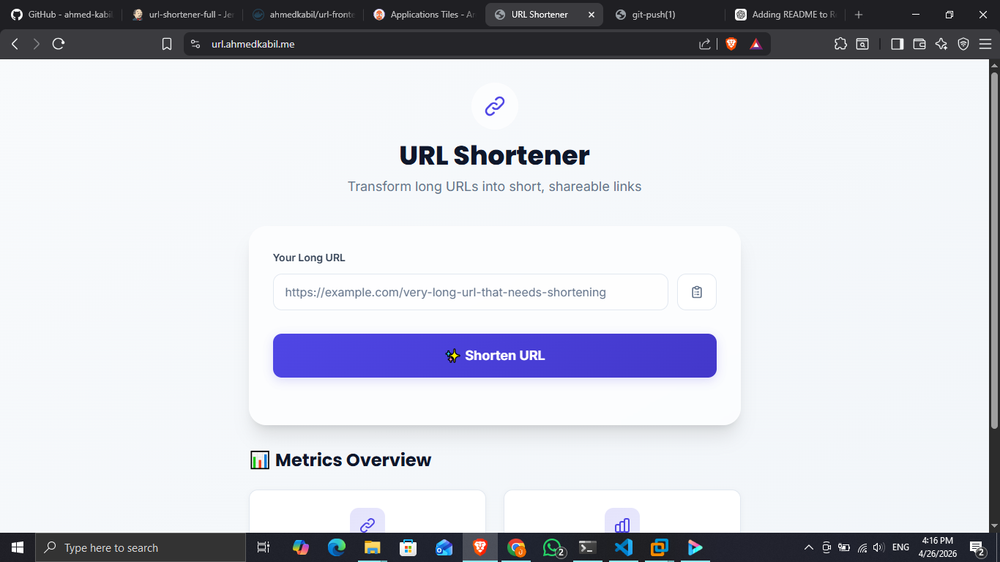
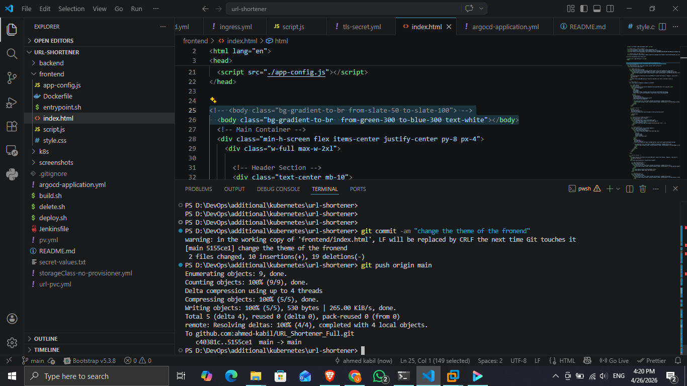
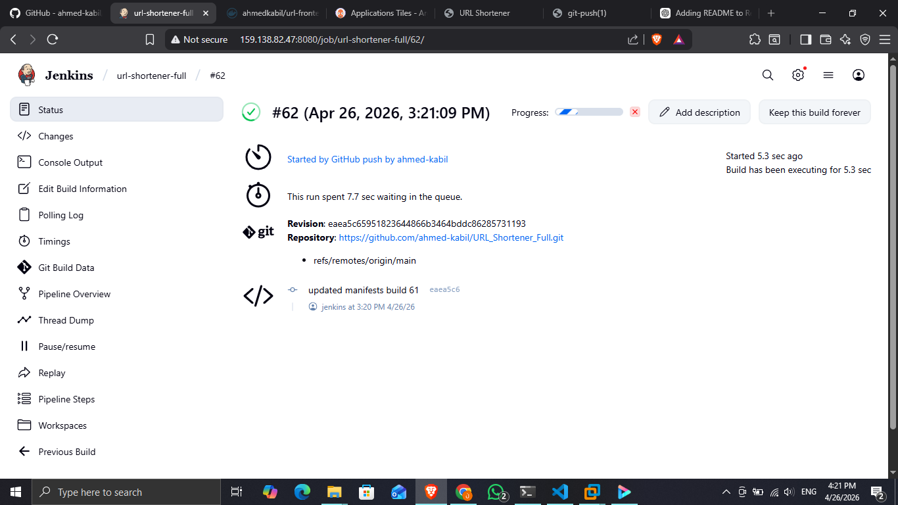
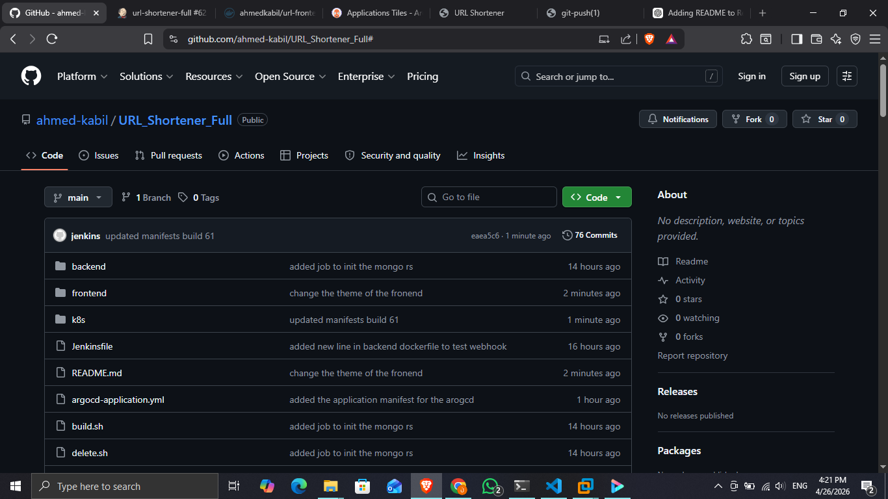
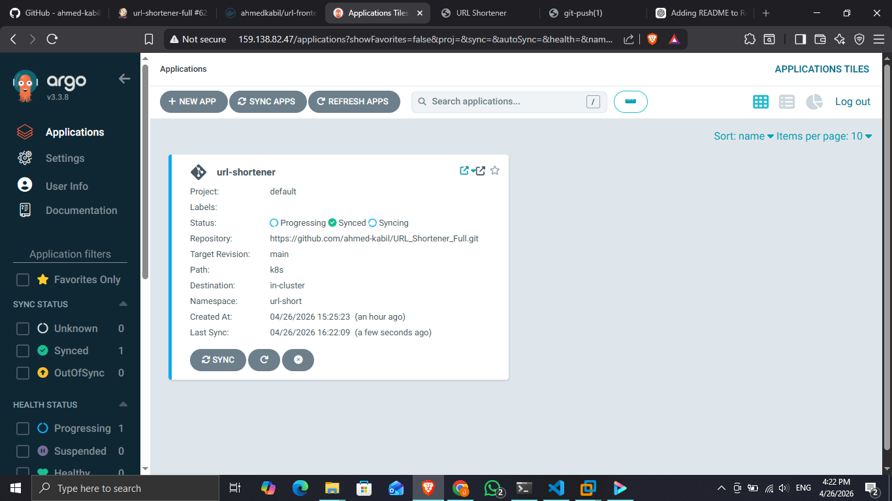
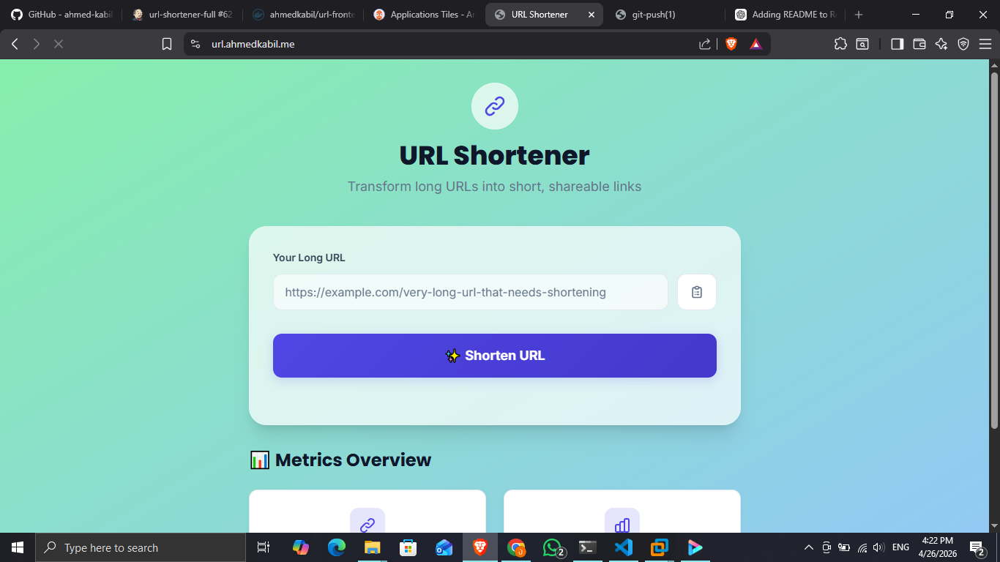

# 🔗 URL Shortener – Full DevOps Pipeline Project

## 📌 Overview

This project is a **full-stack URL shortening application** built completely from scratch, combined with a **production-style CI/CD pipeline**.

It demonstrates how modern systems are built, containerized, and deployed automatically using:

* Custom Frontend (HTML, CSS, JavaScript)
* Backend (Node.js + MongoDB)
* Docker & Docker Hub
* Jenkins (CI)
* Kubernetes (Deployment)
* Argo CD (CD / GitOps)

---

## 🏗️ Architecture

The system follows a complete DevOps lifecycle:

```text
Developer → GitHub → Jenkins (CI) → Docker Hub → GitHub (K8s manifests) → ArgoCD → Kubernetes Cluster → Live Application
```

---

## ⚙️ Tech Stack

### Frontend

* HTML
* CSS
* JavaScript

### Backend

* Node.js
* Express
* MongoDB

### DevOps

* Docker
* Jenkins
* Kubernetes
* Argo CD

---

<!-- ### App Before

📸 App before changes:

 -->

## 🚀 CI/CD Pipeline Flow

### Step 1: Code Push

* Change the background color
* Developer pushes code to GitHub
* Webhook triggers Jenkins pipeline

📸 Push Code Changes:



### Step 2: Jenkins (CI)

* Builds application
* Creates Docker image
* Pushes image to Docker Hub
* Updates Kubernetes manifests with new image tag
* Pushes updated manifests back to GitHub

📸 Jenkins Pipeline:



---

### Step 3: GitOps Trigger

* Argo CD detects changes in Kubernetes manifests

📸 Updated Manifests in GitHub:



---

### Step 4: Argo CD (CD)

* Automatically syncs changes
* Applies updates to Kubernetes cluster

---

### Step 5: Kubernetes Deployment

* MongoDB runs using **StatefulSet**
* Backend & Frontend run as **Deployments**
* **ReplicaSets** ensure high availability
* **Ingress Controller** exposes the application
* TLS enabled for secure HTTPS access

---

## 🌐 Application Flow (Before Update)

📸 Initial Version:


---

## ⚙️ CI/CD in Action (Argo CD Sync)

📸 Argo CD Syncing:



---

## 🔄 Application Flow (After Update)

After pushing new code, the full pipeline executes automatically.

⏱️ **Deployment Time:** ~1 minute 40 seconds

📸 Updated Version:



---

## 📁 Project Structure

```text
.
├── frontend/
├── backend/
├── k8s/
│   ├── deployment.yaml
│   ├── service.yaml
│   ├── ingress.yaml
│   └── statefulset.yaml
├── Jenkinsfile
└── README.md
```

---

## 🔐 Security Notes

* No secrets are stored in the repository
* Sensitive data is managed using Kubernetes Secrets
* TLS is enabled for secure communication

---

## 🧠 Key Concepts Demonstrated

* Full CI/CD automation
* GitOps workflow using Argo CD
* Containerization with Docker
* Kubernetes production patterns (StatefulSet, Ingress, ReplicaSets)
* Automated image versioning and deployment

---

## 👨‍💻 Author

Ahmed Sabry

---

## ⭐ Notes

This project is designed to simulate a **real-world production pipeline** and demonstrates strong DevOps and backend engineering skills.
